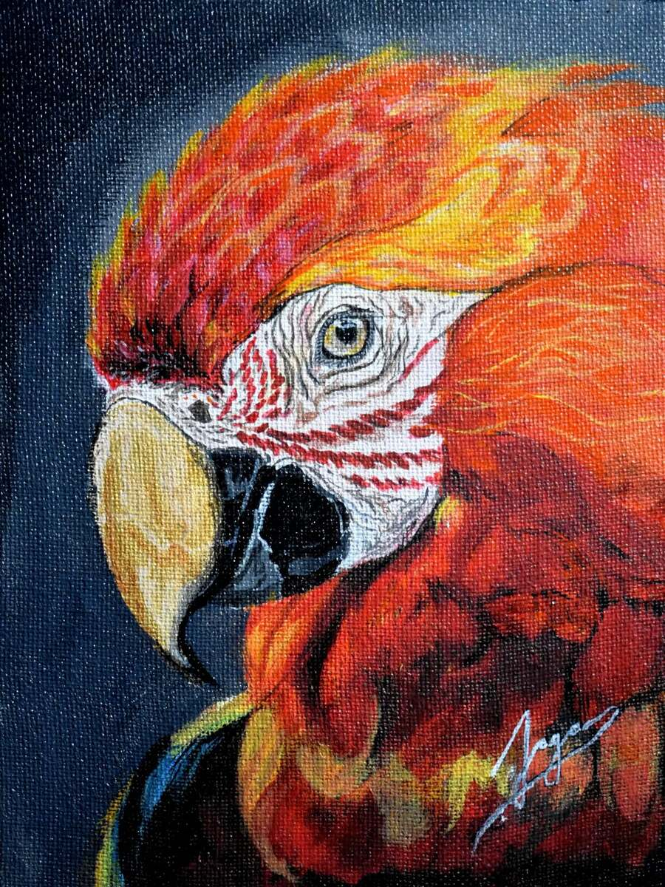

# How This Website Works — Admin Guide

Written and tested by the admin for the admin. Read top to bottom. Fix problems bottom-up.

---

## 1. The Big Picture (What Kind of Thing Is This?)

This website is a **static HTML site**. That means:

- Every page (`index.html`, `gallery.html`) is a single file you can open in any browser.
- There is **no live database** required to show the site. The pages load exactly as written.
- The site is **hosted on Cloudflare Pages** (`artfolio.pages.dev` mapped to `jagansartfolio.com`).
- When you change a file and push to GitHub, Cloudflare rebuilds and publishes the site.

**Analogy:** Think of it like a printed brochure. You design it in a word processor (this folder), print it (Cloudflare), and people read it online. There is no server "thinking" while someone visits — it just sends the file as-is.

---

## 2. File Structure — What's Where

```
/home/dhh/Projects/test/artfolio/
├── index.html          → Main site (hero, about, gallery preview, shop, commission)
├── gallery.html         → Full 203-artwork gallery, organized by medium, with lightbox
├── assets/
│   ├── artworks/        → All 203 artworks in subfolders (Oil/, Acrylic/, Charcoal/ etc.)
│   └── logo.svg         → Brand mark
├── js/
│   ├── admin.js         → Optional backend admin panel (Supabase connection)
│   └── (other JS files for gallery/lightbox — embedded in HTML or separate)
├── css/                 → Stylesheets (if separate; currently embedded in HTML)
└── functions/           → Old Neon database code (not active; removed in current build)
```

**Key rule:** `assets/artworks/` holds the real art. Every `.jpg` in there appears in the gallery. If you add or remove a file there, the gallery updates when rebuilt.

---

## 3. How Content Appears — The Three Layers

### Layer 1: The HTML Page (`index.html`, `gallery.html`)

This is the text, layout, sections, buttons, links. Open any `.html` file in a text editor (VS Code, nano, etc.). It contains:

- `<head>` → Title, meta description, fonts, styles (CSS inside `<style>` tags), links to external resources.
- `<body>` → Everything a visitor sees: hero, about, gallery cards, shop, form.

**Example — changing your bio:**
Open `index.html`, find the text starting with `"I studied biotechnology..."`, edit it, save.

### Layer 2: The Images (`assets/artworks/`)

Every artwork is a `.jpg` file inside a medium-named folder. The site references them like:

```html

```

**How to add a new artwork to the gallery preview:**
1. Save the image to `assets/artworks/` under the correct medium folder (e.g., `Oil/new_piece.jpg`).
2. Open `index.html`.
3. Find the `<div id="gallery-grid">` section.
4. Add a new `<article class="gallery-item">` block pointing to your file.
5. Save, commit, push.

**How the full gallery (`gallery.html`) works:** It reads from the folder structure or an organized JSON file. If the JSON is missing, it may fall back to scanning directories. Ensure `assets/artworks_organized.json` stays current if the site uses it.

### Layer 3: The Styles (CSS inside HTML)

All colors, fonts, spacing, and layout rules live inside the `<style>...</style>` block in the `<head>` of each `.html` file.

- `var(--gold)` = the gold accent color (`#c9a96e`).
- `var(--bg)` = dark background (`#0d0d0d`).
- Changing these variables changes the site globally.

---

## 4. How Updates Reach the Live Site — The Pipeline

This is the most important part. Learn it once, fix anything forever.

### Step A: Edit
```
Edit index.html (or gallery.html, or add an image to assets/artworks/)
```

### Step B: Save
The file is saved locally in `/home/dhh/Projects/test/artfolio/`.

### Step C: Commit (Create a Snapshot)
```
git add .
git commit -m "Fixed bio text and added new oil painting"
```

This creates a named snapshot of all changes.

### Step D: Push to GitHub
```
git push
```
This uploads the snapshot to `github.com/jagan-jai/artfolio`.

### Step E: Cloudflare Rebuilds
Cloudflare Pages detects the new commit, rebuilds the site, and deploys it to:
- `https://jagansartfolio.com`
- `https://www.jagansartfolio.com` (if configured correctly in DNS + Custom Domains)

**Time:** Usually 30-90 seconds.

---

## 5. How to Diagnose Problems — Troubleshooting Guide

### Problem: "The site is down / not loading"

**Check 1 — Is it the domain or the page?**
```
curl -I https://jagansartfolio.com
```
- `200` = site is up.
- `403` or `404` = domain/DNS/custom domain issue (see Section 7).
- `Connection timed out` = Cloudflare Pages down or domain pointing wrong.

**Check 2 — Is it just `www.`?**
```
curl -I https://www.jagansartfolio.com
```
- If `jagansartfolio.com` works but `www.` fails: missing custom domain in Cloudflare Pages or missing `www` CNAME in DNS.

**Check 3 — Check Cloudflare Pages Dashboard**
Go to `dash.cloudflare.com` → Workers & Pages → `artfolio` → Deployments.
- Green check = deployed.
- Red X = build failed. Click it to read the error.

### Problem: "Images are broken"

**Check 1 — Does the file actually exist?**
```
ls assets/artworks/Oil/
```
Look for the exact filename the HTML references (e.g., `artwork_003.jpg`).

**Check 2 — Is the path correct in HTML?**
Open `gallery.html` or `index.html`. Find the broken image. The `src=` must match exactly:
```
assets/artworks/Oil/artwork_003.jpg
```
Not `artworks/` (missing `assets/`), not `assets/Oil/` (folder must match).

**Check 3 — Is it a case-sensitive name?**
Linux servers treat `Oil.jpg` and `oil.jpg` as different files. Use lowercase folders and filenames consistently.

### Problem: "My edit isn't showing on the live site"

**Check 1 — Did you save?** Confirm the file shows your new text.
**Check 2 — Did you commit?**
```
git status
```
If files are red, run:
```
git add .
git commit -m "..."
```
**Check 3 — Did you push?**
```
git push
```
**Check 4 — Did Cloudflare deploy?** Check the Deployments page in Cloudflare Dashboard.
**Check 5 — Browser cache.** Hard refresh: `Ctrl+Shift+R` (or `Cmd+Shift+R` on Mac).

---

## 6. The Admin Panel (`js/admin.js`)

There is an optional backend admin interface (`admin.html` or embedded in the page) that connects to **Supabase** (a database service). It lets you:
- Add/edit artworks without touching HTML files.
- Manage mediums.
- Update Instagram feed settings.

**How it works:**
- `admin.js` tries to connect to `window.artfolio.supabase` (configured in the page or via environment variables).
- If Supabase is not configured, the admin panel shows "Not connected" and works in demo mode only.

**To use it fully:** The site needs a `DATABASE_URL` and `SUPABASE_URL` / `SUPABASE_KEY` set up. In the current build, these are removed from the public site for security. If you want to restore the backend:
1. Set up a Supabase project.
2. Add the connection details to the site's environment variables (Cloudflare Dashboard → Settings → Environment variables).
3. Ensure `functions/api/` files are present and `wrangler.toml` is configured.

**For now, the simplest approach is manual HTML editing** (Section 3 above). It always works and never depends on a database.

---

## 7. Domain & DNS — How `www.` Works

The site lives on Cloudflare Pages at `artfolio.pages.dev`. Your domain (`jagansartfolio.com`) points to it through **DNS records**.

**Required records (in Cloudflare DNS):**

| Type | Name | Content | Proxy |
|---|---|---|---|
| A | `jagansartfolio.com` | *(auto-filled by Pages)* | 🟠 Proxied |
| CNAME | `www` | `artfolio.pages.dev` | 🟠 Proxied |

**Also required in Cloudflare Pages (Custom Domains):**
1. Go to Pages → `artfolio` → Custom domains.
2. Add `jagansartfolio.com`.
3. Add `www.jagansartfolio.com`.

If either is missing, you get:
- Error 1014 (CNAME conflict)
- TLS certificate SAN error (the error you saw)
- 403 Forbidden (host not allowed)

---

## 8. How to Enhance — Common Tasks

### Add a New Section to the Main Page

1. Open `index.html`.
2. Find the closing `</main>` tag or a section you want to insert after.
3. Copy an existing `<section>` block (e.g., the Shop or Commission section).
4. Change the `id=`, headings, and content.
5. Save → Commit → Push.

### Change the Color Theme

In the `<style>` block at the top of `index.html`:
```
--gold: #c9a96e;     → Change to any hex color (e.g., #8b6e3a for darker gold)
--bg: #0d0d0d;         → Background
--text: #f5f5f5;      → Main text
```
Save, commit, push. The change is instant.

### Update Gallery Artworks Manually

1. Place the image in `assets/artworks/MediumName/filename.jpg`.
2. Open `gallery.html`.
3. Find the grid of artworks. Copy an existing `<article>` block.
4. Update `src=`, `alt=`, title, year, and medium.
5. Save, commit, push.

### Fix a Broken Link or Button

Find the `<a href="...">` tag in `index.html`. Ensure:
- Internal links start with `#` (e.g., `#commission`) or are filenames (e.g., `gallery.html`).
- External links start with `https://`.
- No broken `href` values.

---

## 9. Security & Maintenance Notes

- **No passwords are stored in this repo.** The `formsubmit.co` email form sends directly to `jagansartfolio@gmail.com`. If you change that email, update the `action=` in the form HTML.
- **Images should not exceed a few MB each.** Large images slow down the site. Compress before adding to `assets/artworks/`.
- **Keep backups.** Before big changes:
  ```
  git log --oneline -5
  git branch backup-before-change
  ```
- **Don't delete `assets/artworks/` folders** unless you intend to remove artworks permanently.

---

## 10. Quick Reference — Commands You Need Most

```
# See what's changed
cd /home/dhh/Projects/test/artfolio
git status

# See last 5 changes
git log --oneline -5

# See current branch
git branch

# Edit a file (example: open in text editor — use VS Code, nano, or vim)
nano index.html

# Save, snapshot, upload
git add .
git commit -m "Added bio update"
git push

# Check if the site is live
curl -I https://jagansartfolio.com

# List artworks
ls assets/artworks/
```

---

## 11. What I'm Teaching You Here

The most important concept: **This site is under your control.** Every piece of text, every image, every button is a line in a file you can edit. There is no hidden server doing mysterious things. If something breaks, it is almost always one of these:

1. A file wasn't saved.
2. The file wasn't committed and pushed.
3. The image path is wrong.
4. The domain/DNS isn't configured right.
5. The browser is showing an old cached version.

Fix them in that order, and you will never be stuck.

---

*Written: October 4, 2026. Refer to this file (`~/Work/admin-guide.md` or this workspace file) whenever you need to diagnose, repair, or improve the site. Keep it current as you learn more.*
